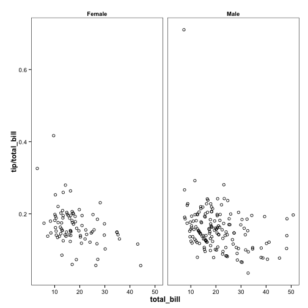

ggplot2 stuff
========================================================

These are some themes, scripts, and other things related to making plots with
[ggplot2](http://ggplot2.org).

**NOTE**: This package has been replaced by [ggplot2bdc](https://github.com/briandconnelly/ggplot2bdc)

Themes
---------------

These themes can be used in one of a few ways:

* Use `source(theme_bdc_<whatever>.r)` to import the theme before plotting
* Copy and paste the code into your console before plotting
* Copy and paste the code into your `.Rprofile`, and it'll always be available (after restarting R)

Please note that the example plots can easily be made to look better (e.g. by chainging aspect ratios, adding labels, etc.), but I've kept them minimal to highlight where the theme comes into play.

### `theme_bdc_classic`

This theme creates "classic" looking plots with basic black axis lines. While it can be used with faceted graphs, it's probably best suited for single plots.


```r
ggplot(cars, aes(x = speed, y = dist)) + geom_point(pch = 1) + theme_bdc_classic()
```

 


### `theme_bdc_simplefacets`

This theme places data within a boxed panel and is therefore recommended with plots with multiple facets. For the following example, we'll use the `tips` data from the `reshape2` package.


```r
library(reshape2)
```


Ok, now let's plot the tip as a fraction of the total bill. We'll divide the data between men and women:


```r
ggplot(tips, aes(x = total_bill, y = tip/total_bill)) + geom_point(pch = 1) + 
    facet_grid(. ~ sex) + theme_bdc_simplefacets()
```

 


Are men better tippers than Women on Thursdays?


```r
ggplot(tips, aes(x = total_bill, y = tip/total_bill, color = sex)) + geom_point(pch = 1) + 
    facet_grid(. ~ day) + theme_bdc_simplefacets()
```

 


### `theme_bdc_greyfacets`


```r
ggplot(tips, aes(x = total_bill, y = tip/total_bill)) + geom_point(pch = 1) + 
    facet_grid(. ~ sex) + theme_bdc_greyfacets()
```

 


```r
ggplot(tips, aes(x = total_bill, y = tip/total_bill, color = sex)) + geom_point(pch = 1) + 
    facet_grid(. ~ day) + theme_bdc_greyfacets()
```

 


Scripts
----------
*None yet*
